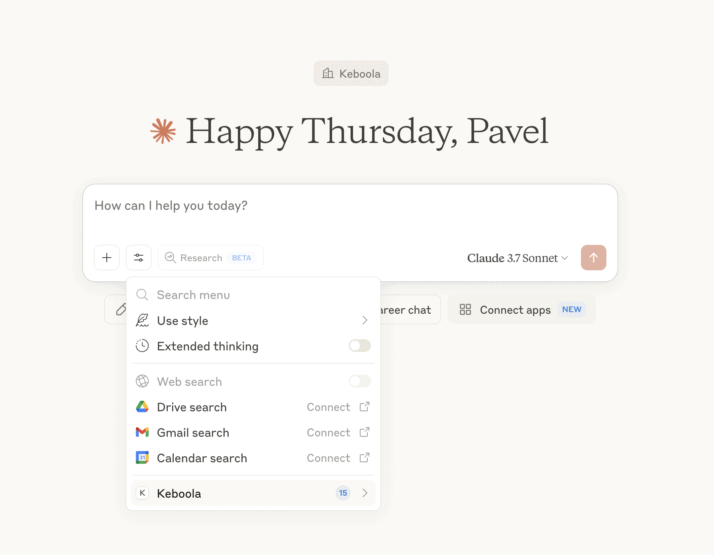

<p align="center">
  
</p>

# Keboola MCP Server
---

[](https://badge.fury.io/py/keboola-mcp-server)
[](https://pypi.org/project/keboola-mcp-server/)
[](https://github.com/keboola/keboola-mcp-server/actions/workflows/ci.yml)
[](https://opensource.org/licenses/MIT)


> **Keboola MCP Server** Connect your data to **Cursor**, **Claude**, **Windsurf**, **VS Code**, and other AI assistants—with pipelines that deliver the right data when and where they need it.

<!-- Show animated gif so people understand  -->

> This is where data engineering feels less like coding—and more like just writing one last prompt.

## 💡 Example Usage

Simplify your data workflows by talking directly to your pipeline infrastructure. Here's what you can do:

- 🤝 **Data Integration** - "Connect our Shopify store to the warehouse and create unified customer profiles that merge online and offline behavior."
- 🔄 **Data Transformation** - "Create a transformation that normalizes product data across all our e-commerce platforms and enriches it with supply chain metrics."
- 🚀 **Workflow Automation** - "Schedule our marketing data pipeline to run daily at 6am, send alerts if data quality thresholds aren't met, and trigger the BI refresh."
- 📝 **Documentation & Governance** - "Document all tables in our CUSTOMER_360 pipeline with their lineage, data definitions, and ownership information."
- 📊 **Exploration** - "What sales data sources do we have in Keboola? Show me completeness, update frequency, and where they're being used."
- 🔍 **Analysis** - "Analyze our customer retention by segment and acquisition channel, highlighting which cohorts had the highest churn."
- 🧮 **Calculations** - "Calculate our monthly recurring revenue by product category, showing growth trends and seasonality patterns."
- 📈 **Visual Reporting** - "Build a cross-channel marketing performance dashboard with ROI metrics and campaign attribution analysis"

Connect, transform, and automate your data workflows with Keboola MCP - where complex data operations are just a conversation away.


#Setup

---

## Access Your Data Superpower
Get started with [Agent Max](https://chat.keboola.com/) - our intuitive MCP UI that turns complex data operations into simple conversations. Experience the full power of agentic data workflows with just a few clicks!

> Already using Keboola? Connect your existing project by reaching out through [GitHub Issues](https://github.com/keboola/mcp-server/issues) for priority access.


<!-- Youre talking about agents and agentic world but where are the agentic stack tools ? Supabase, a2a support, data to frameworks like Crew, Langchain, etc. ? They should be on top @chocho -->

## ✅ Compatibility

### MCP Client Support

| **MCP Client** | **Support Status** | 
|----------------|-------------------|
| Claude (Desktop & Web) | ✅ supported, tested |
| Cursor | ✅ supported, tested | 
| Windsurf, Zed, Replit | ✅ Supported | 
| Codeium, Sourcegraph | ✅ Supported | 
| Custom MCP Clients | ✅ Supported | 


## 🚀 Quick Start Guide

### Prerequisites

Before getting started, make sure you have:

- [ ] Python 3.10+ installed
- [ ] Access to a Keboola project
- [ ] Your preferred MCP client (Claude, Cursor, etc.)

You'll also need these environment variables:

| Variable | Required | Description |
|----------|----------|-------------|
| `KBC_STORAGE_TOKEN` | Yes | Your Keboola Storage API token |
| `KBC_WORKSPACE_SCHEMA` | For queries | Your Keboola workspace schema name |
| `GOOGLE_APPLICATION_CREDENTIALS` | For BigQuery | Path to Google credentials JSON file |


```bash
# Quickest way to get your KBC_STORAGE_TOKEN ( NOT WORKING NOW!)
curl -X POST https://chat.keboola.com/api/register -d '{"email":"your@email.com"}'
```
Follow this [Keboola guide](https://help.keboola.com/tutorial/manipulate/workspace/) to get your KBC_WORKSPACE_SCHEMA.


### 1. Installation

**Note**: Make sure you have `uv` installed. The MCP client will use it to automatically download and run the Keboola MCP Server. 
**Installing uv**:
 
*macOS/Linux*:
 ```bash

#if homebrew is not installed on your machine use:
# /bin/bash -c "$(curl -fsSL https://raw.githubusercontent.com/Homebrew/install/HEAD/install.sh)"

 # Install using Homebrew
 brew install uv

 ```
 
 *Windows*:
 ```powershell
 # Using the installer script
 powershell -ExecutionPolicy ByPass -c "irm https://astral.sh/uv/install.ps1 | iex"
 
 # Or using pip
 pip install uv
 
 # Or using winget
 winget install --id=astral-sh.uv -e
 ```

 >For more installation options, see the [official uv documentation](https://docs.astral.sh/uv/getting-started/installation/).

### 2. Keboola Region

Your Keboola API URL depends on your deployment region. You can determine your region by looking at the URL in your browser when logged into your Keboola project:

| Region | API URL |
|--------|---------|
| AWS North America | `https://connection.keboola.com` |
| AWS Europe | `https://connection.eu-central-1.keboola.com` |
| Google Cloud EU | `https://connection.europe-west3.gcp.keboola.com` |
| Google Cloud US | `https://connection.us-east4.gcp.keboola.com` |
| Azure EU | `https://connection.north-europe.azure.keboola.com` |

---

#Project admin mode
<!-- @chocho add here how to run MCP in read/write, integrations, etc. -->

#Project read only mode
<!-- @chocho - write here how to just read for data analyses, etc.  -->

# 💻 AI Assistant Integration
---
### Claude Desktop Configuration

```json
{
  "mcpServers": {
    "keboola": {
      "command": "uvx",
      "args": [
        "--from",
        "keboola_mcp_server",
        "keboola-mcp",
        "--api-url",
        "https://connection.YOUR_REGION.keboola.com"
      ],
      "env": {
        "KBC_STORAGE_TOKEN": "your_keboola_storage_token",
        "KBC_WORKSPACE_SCHEMA": "your_workspace_schema"
      }
    }
  }
}
```

### Claude Desktop Configuration (with Docker)

```json
{
  "mcpServers": {
    "keboola": {
      "command": "docker",
      "args": [
        "run",
        "--rm",
        "-i",
        "keboola/mcp-server:latest",
        "--api-url", "https://connection.YOUR_REGION.keboola.com",
        "KBC_STORAGE_TOKEN": "your_keboola_storage_token",
        "KBC_WORKSPACE_SCHEMA": "your_workspace_schema"
      ]
    }
  }
}
```

### Cursor Integration

1. Open Settings → Features → MCP Servers
2. Click "+ Add new global MCP server"
3. Fill in the configuration details similar to the Claude example above

### Integration with Other Platforms

The Keboola MCP Server can be integrated with nearly any platform that supports the MCP protocol or HTTP/SSE:

#### 🤖 Agent Frameworks
- **[CrewAI](https://github.com/joaomdmoura/crewAI)**: Add Keboola as a custom tool provider to your agent crew
- **[AutoGen](https://github.com/microsoft/autogen)**: Register Keboola tools with AutoGen's `AssistantAgent`
- **[LangChain](https://python.langchain.com/)**: Use Keboola as a tool provider in your LangChain applications

#### 🔄 Automation Platforms
- **[Zapier](https://zapier.com/)**: Connect via webhooks to trigger Keboola jobs based on events
- **[n8n](https://n8n.io/)**: Use HTTP nodes to query data or trigger transformations
- **[Make](https://www.make.com/)**: Create scenarios that leverage Keboola data operations

#### 🧠 AI Applications
- **[Perplexity](https://www.perplexity.ai/)**: Connect via MCP for data-backed answers
- **[Discord Bots](https://discord.com/developers/docs/intro)**: Create data-aware bots that query your Keboola project
- **Custom Apps**: Use Keboola for data operations in your web/mobile applications

**Integration Method**: All platforms connect to Keboola MCP Server via HTTP + Server-Sent Events (SSE) or stdio, making integration seamless regardless of programming language or environment.

---

# 🧰 Supported Tools

**Note:** Keboola MCP is pre-1.0, so some breaking changes might occur. Your AI agents will automatically adjust to new tools.

| Category | Tool | Description |
|----------|------|-------------|
| **Storage** | `retrieve_buckets` | Lists all storage buckets in your Keboola project |
| | `get_bucket_detail` | Retrieves detailed information about a specific bucket |
| | `retrieve_bucket_tables` | Returns all tables within a specific bucket |
| | `get_table_detail` | Provides detailed information for a specific table |
| | `update_bucket_description` | Updates the description of a bucket |
| | `update_table_description` | Updates the description of a table |
| **SQL** | `query_table` | Executes custom SQL queries against your data |
| | `get_sql_dialect` | Identifies whether your workspace uses Snowflake or BigQuery SQL dialect |
| **Component** | `retrieve_components` | Lists all available extractors, writers, and applications |
| | `get_component_details` | Retrieves detailed configuration information for a specific component |
| | `retrieve_transformations` | Returns all transformation configurations in your project |
| | `create_sql_transformation` | Creates a new SQL transformation with custom queries |
| **Job** | `retrieve_jobs` | Lists and filters jobs by status, component, or configuration |
| | `get_job_detail` | Returns comprehensive details about a specific job |
| | `start_job` | Triggers a component or transformation job to run |
| **Documentation** | `docs_query` | Searches Keboola documentation based on natural language queries |
---

## 🛠️ Troubleshooting & Debugging

### Common Issues

| Issue | Solution |
|-------|----------|
| **Authentication Errors**, **Token Not Found** | Verify your `KBC_STORAGE_TOKEN` environment variable is set with a valid token |
| **Workspace Issues** | Confirm `KBC_WORKSPACE_SCHEMA` is correct and accessible |
| **Connection Timeout** | Check network connectivity to your Keboola region |
| **Missing Tables** | Ensure your token has access to the required buckets |
| **SQL Query Errors** | Verify SQL dialect matches your backend (Snowflake/BigQuery) |


---

## 🧪 Testing or debugging

### Manual CLI Mode 

You can run the server manually in a terminal for testing or debugging:

```bash
# Set environment variables
export KBC_STORAGE_TOKEN=your_keboola_storage_token
export KBC_WORKSPACE_SCHEMA=your_workspace_schema
# For BigQuery users
# export GOOGLE_APPLICATION_CREDENTIALS=/full/path/to/credentials.json

# Run with uvx (no installation needed)
uvx keboola_mcp_server --api-url https://connection.YOUR_REGION.keboola.com

# OR, if developing locally
python -m keboola_mcp_server.cli --api-url https://connection.YOUR_REGION.keboola.com
```

> **Note**: This mode is primarily for debugging or testing. For normal use with Claude or Cursor, you do not need to manually run the server.

### Using Docker

```bash
docker pull keboola/mcp-server:latest

# For Snowflake users
docker run -it \
  -e KBC_STORAGE_TOKEN="YOUR_KEBOOLA_STORAGE_TOKEN" \
  -e KBC_WORKSPACE_SCHEMA="YOUR_WORKSPACE_SCHEMA" \
  keboola/mcp-server:latest \
  --api-url https://connection.YOUR_REGION.keboola.com

# For BigQuery users (add credentials volume mount)
# docker run -it \
#   -e KBC_STORAGE_TOKEN="YOUR_KEBOOLA_STORAGE_TOKEN" \
#   -e KBC_WORKSPACE_SCHEMA="YOUR_WORKSPACE_SCHEMA" \
#   -e GOOGLE_APPLICATION_CREDENTIALS="/creds/credentials.json" \
#   -v /local/path/to/credentials.json:/creds/credentials.json \
#   keboola/mcp-server:latest \
#   --api-url https://connection.YOUR_REGION.keboola.com
```

---

# Keboola Core
A high level overview of what capabilities are exposed via the MCP Server from the underlying Keboola Core.
<p align="center">
  
</p>

# Claude Integration
A few screenshots from Claude using Keboola MCP Server.
<p align="center">
  
</p>


## 🔗 Stay in Touch

  <a href="https://www.linkedin.com/company/keboola">LinkedIn</a> •
  <a href="https://x.com/keboola">X</a> •
  <a href="https://changelog.keboola.com/">Changelog</a>


---

## 🧭 Want to Go Further?

- 📘 [User Docs](https://docs.keboola.com/)
- 📘 [developer Docs](https://developers.keboola.com/)
- 🌐 [Keboola Platform](https://www.keboola.com)
- 🛠 [Keboola Playground](https://chat.canary-orion.keboola.dev/)
